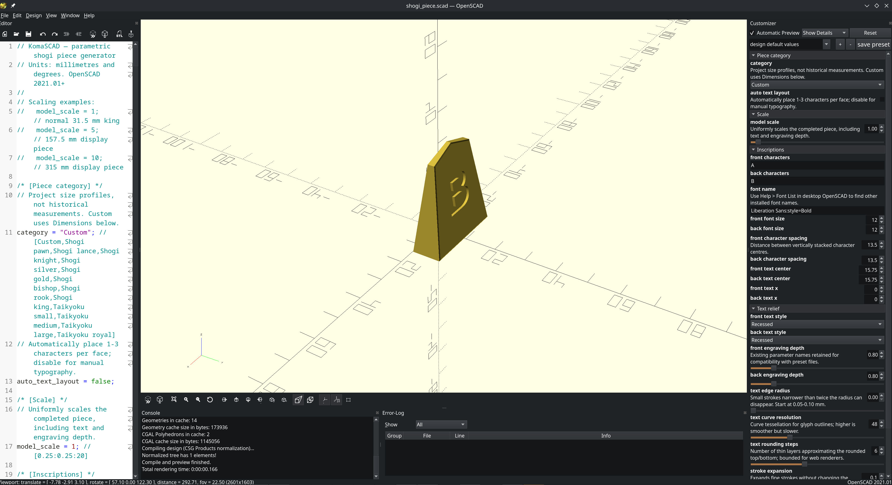

# KomaSCAD


KomaSCAD is an open-source parametric generator for shogi pieces, written in OpenSCAD. It produces complete, printable 3D models of pieces from their inscribed characters and a defined set of parameters governing dimensions, edge geometry and lettering.

The project consists of the piece generator, a base preset, an exporter for multicolour models, and documentation covering piece geometry, typography and every configurable parameter.



## Features

**Piece shape**

- Adjustable length, heel width, heel thickness and tip thickness, with a configurable edge bevel.
- A pawn-circle constraint that holds the piece angles to values at which twenty pieces placed side by side close into a ring.

**Lettering**

- Separate inscriptions for the front and back of each piece, such as a piece's name and its promoted name.
- Support for any installed font that contains the required characters.
- Size, spacing, position and proportions set independently for each face, with further adjustment of individual characters.
- Stroke expansion, which thickens or thins the strokes of the chosen font.
- Recessed or raised lettering for single-filament printing, with face-only, painted-groove or flush-inlay material regions for multicolour printing.
- An option to apply the front's typography settings to the back.
- A maker's signature inscribed on the heel.

**Inspection and export**

- Inspection views that mark the safe lettering region, highlight overflow, and check the signature and pawn circle.
- STL export of complete single-material pieces or blank bodies.
- Multicolour export to a single 3MF file containing aligned, named parts for the body, front lettering, back lettering and signature.
- Named presets that store a complete piece design for reuse and sharing.

Every configurable parameter is documented, with its default value, in the
[parameter reference](docs/parameters.md). The [documentation index](docs/README.md)
links the longer guides.

## Requirements

- [OpenSCAD 2021.01](https://openscad.org/downloads.html).
- A font containing the Japanese characters you intend to use. The default is Noto Serif CJK JP SemiBold, available from [Noto CJK](https://github.com/notofonts/noto-cjk). Six optional, redistributable OFL fonts are bundled in [fonts](fonts/suggested_fonts.md); install one and restart OpenSCAD before use.
- A filament 3D printer and a slicer. KomaSCAD does not depend on any particular brand.
- For multicolour export only: Python 3.8 or later, with the `openscad` command available on your PATH. The exporter uses only the Python standard library.

## Installation

1. Download this repository with **Code → Download ZIP**, or clone it with Git.
2. Install the font you intend to use, then start or restart OpenSCAD so that it detects the font.

Keep `shogi_piece.scad` and `shogi_piece.json` in the same folder. OpenSCAD loads a model's presets from the JSON file that shares its name.

## Getting started

**Model is the main workspace**, and every bundled preset opens there. With Customizer's **Automatic Preview** enabled, geometry, font, relief and selected material colours update together. The same design can become an ordinary single-material STL or an automatically assigned multipart 3MF without changing modes.

1. Open `shogi_piece.scad` in OpenSCAD. If the Customizer panel is not visible, uncheck **Window → Hide Customizer**.
2. At the top of the Customizer, select the preset **00 Base - King**. It opens in Model and updates automatically. F5 is only a fallback if Automatic Preview is disabled.
3. Find the exact name of your font under **Help → Font List**, and enter it in the Customizer's font setting without quotation marks.
4. Enter the inscriptions in **Front Characters** and **Back Characters**. Characters are stacked from the point of the piece towards the heel. Leave Back Characters empty for a blank reverse side.
5. Set the mode to **Inspect front** and press F5. The blue area is the safe lettering region; lettering highlighted in red extends beyond it and will be clipped. Repeat with **Inspect back**.
6. Return to **Model** and leave **Print Orientation** at **Upright**. For one single-material file, press F6 and choose **File → Export → Export as STL**. For the shown colours, use the 3MF exporter below instead.
7. Open the STL in your slicer, check the toolpaths, and print one test piece before printing a full set.

To keep your design, save it as a named preset in the Customizer. The
[preset guide](docs/presets.md) explains how to save, share and extend presets.

## Export modes

| To produce | Mode | Procedure |
| --- | --- | --- |
| A single-filament piece with recessed or raised lettering | Model | Render (F6), then export STL |
| A piece body without lettering | Blank | Render (F6), then export STL |
| A layout check of the lettering, signature or pawn circle | An Inspect mode | Preview (F5) only |

## Multicolour printing

Model displays the selected body, front, back and signature materials directly. The default **Face only** treatment keeps recessed groove walls in the body material and places colour at the visible floor. **Painted grooves** colours the walls too; **Flush filled** closes the recess with a level inlay. Relief depth remains `0.2 mm` in the bundled presets, while the exporter automatically extends each colour region `0.8 mm` into the piece so an ordinary 0.4 mm extrusion system can produce it reliably. That internal support thickness does not change the outside geometry or engraving depth.

1. Shape the piece and choose its font in **Model**. Use the Inspect modes when you want the flat safe-area guides, then return to Model.
2. Under **07 – Filament colours**, choose the body, front, back and optional signature materials. Model updates immediately.
3. Keep **Face only** for body-coloured groove walls, or choose **Painted grooves** or **Flush filled**. Keep **Protect Face Edges** enabled.
4. Save the finished settings as a named preset. The exporter reads saved presets because a separate process cannot see unsaved Customizer changes.
5. Open a terminal in the project folder and run the exporter. No F6 render is needed first.

   ```bash
   python3 scripts/komascad_export.py --preset '00 Base - King' --output king.3mf
   ```

6. Import `king.3mf` into your slicer as a single multipart object. Keep the parts in their original positions. Standard colour properties are already attached to the named parts, so compatible slicers create the logical filament assignments without painting strokes or selecting each part. Confirm that those colours match the spools physically loaded in your printer.

> [!WARNING]
> Use the Python exporter for colour 3MF. OpenSCAD 2021.01's native 3MF export does not preserve this multipart material assignment. The internal part modes are deliberately hidden from Customizer.

Before printing, note the following:

- The exported file is a 3MF model, not G-code or a slicer project. Slicers that ignore standard colour properties may still require assignment by part name.
- The exporter uses standard 3MF Core and Materials and Properties resources. It does not claim to be a vendor slicer or embed proprietary printer/project configuration.
- The colours chosen in the Customizer identify each part. The printed finish, including any metallic or glitter effect, depends on the filament you load.
- In Upright orientation, the front and back lettering share layers with the body, so a single filament change at one layer height cannot colour both inscriptions.
- A single-nozzle printer requires a filament-change workflow that supports multicolour printing.
- As an alternative on any printer, print the piece with recessed lettering in one filament and fill the lettering by hand.

The [colour quickstart](docs/colour-quickstart.md) covers material mapping and limitations in more detail.

To export every piece in a preset collection, create a named folder containing
one 3MF per preset with the batch wrapper:

```bash
python3 scripts/komascad_export_set.py \
  --parameters presets/taikyoku.json \
  --set-name "Taikyoku Shogi"
```

Use `--dry-run` to inspect all planned filenames before rendering. The
[batch-export guide](docs/batch-export.md) covers complete collections,
grid-search filtering, manifests, and safe replacement of an older export.

## Mass-editing saved presets

Use `scripts/mass_edit_presets.py` when a parameter needs the same adjustment
across a selected group of saved presets. It uses only Python's standard
library and previews changes by default:

```bash
# List available names and categories.
python3 scripts/mass_edit_presets.py shogi_piece.json --list

# Preview an edit for every matching grid preset.
python3 scripts/mass_edit_presets.py shogi_piece.json \
  --category 'Professional king grid search' --set Base_Width=30

# Write the reviewed edit.
python3 scripts/mass_edit_presets.py shogi_piece.json \
  --category 'Professional king grid search' --set Base_Width=30 --write
```

Use `--preset TEXT` to select names containing text, repeat `--set` to change
several parameters in one pass, and run `--help` for more examples. The script
refuses to edit anything without an explicit selection and will not create a
misspelled parameter unless `--create-missing` is supplied.

## Customizer reference

The Customizer in OpenSCAD 2021.01 cannot be searched. The table below shows where each group of settings is located. For individual parameters, see the [parameter reference](docs/parameters.md) or search the code editor with Ctrl+F. Enable **Show Details** at the top of the Customizer to display each parameter's description and units.

| Settings | Customizer section |
| --- | --- |
| Piece dimensions and tip thickness | 02 – Piece dimensions |
| Text size, spacing, position and proportions | 03 – Front layout; 04 – Back layout |
| Applying the front's settings to the back | 04 – Back layout → Mirror Front Settings |
| Individual characters, including a third character | 05 – Front character adjustments; 06 – Back character adjustments |
| Filament colours and material labels | 07 – Filament colours |
| Stroke weight | 08 – Engraving and stroke weight → Front Stroke Expansion, Back Stroke Expansion |
| Edge bevel and face margins | 09 – Edges and face margin |
| Pawn-circle constraint | 10 – Advanced shape angles → Pawn Circle |
| Text rendering resolution | 11 – Inspection and quality → Text Curve Resolution |
| Maker's signature | 12 – Maker signature on heel |

**Piece dimensions.** The default piece is 31.5 mm long, 28 mm wide at the heel and 9.5 mm thick at the heel, with a tip 3 mm thick before bevelling. These are project defaults, not traditional dimensions. The **Category** setting is a descriptive label only; the dimension settings always determine the shape of the piece.

**Stroke expansion.** Front and Back Stroke Expansion default to +0.12 mm. Set a value of 0 for the font's original weight, or a small negative value to thin the strokes.

**Mirror Front Settings.** When enabled, the back uses the front's typography and engraving settings. The back text and colours remain independent, and the lettering is not reflected. Disabling the setting restores the back's own stored values.

## Troubleshooting

| Problem | Solution |
| --- | --- |
| Model is empty | Current Model preview avoids subtractive 3D OpenCSG operations: it opens only the broad preview face, applies a fast 2D glyph cutout, and displays its floor at the selected recess depth. Reopen the updated SCAD, enable **Design → Automatic Preview**, and select the preset again. Use **View → View All** if needed. |
| A coloured 3MF is invisible in a neutral viewer | Regenerate it with the current exporter. It stores explicit opaque alpha in both standard 3MF colour resources; older generated files may be interpreted as transparent by some viewers. |
| Lettering appears in the model but disappears after slicing | Regenerate the 3MF with the current exporter. Older exports used a 0.2 mm colour backing that a 0.4 mm nozzle could discard; current exports keep the same visible relief depth but provide 0.8 mm of internal support. |
| Bambu Studio 2.8.2.60 says the 3MF has “invalid config” | This version reports the same warning for ordinary geometry-only 3MF files. Dismiss the dialog to load the geometry; the KomaSCAD export intentionally contains no Bambu project config. See [BambuStudio issue #11927](https://github.com/bambulab/BambuStudio/issues/11927). |
| Render fails with a CGAL error | Keep the preset and the full console output, and report the problem as described in [Contributing](#contributing). |
| Previews are slow | Model uses an open-face F5 display proxy with only fast 2D cutouts; use the Inspect modes for flat layout work. Very detailed fonts can still benefit from Text Curve Resolution 24 while composing, then 48 for final export. |
| Kanji appear as boxes, or the wrong font is used | Check the font name against Help → Font List and confirm that the font contains the characters. Restart OpenSCAD after installing a font. |
| Lettering is too heavy | Reduce Front or Back Stroke Expansion, then check thin strokes in the slicer. |
| Lettering is highlighted in red | Reduce the text size or adjust spacing or position. Lettering outside the safe region is clipped, not scaled to fit. |
| Changes to back settings have no effect | Disable Mirror Front Settings. |
| Pawn Circle rejects the angles | Read the console message. The base angle must be 81°, and Angle Mode determines which other angle is derived. |
| The signature prints faintly | In Upright orientation, the signature is printed against the bed. Check the first layers in the slicer and print a test piece. |

## Repository contents

| Path | Description |
| --- | --- |
| `shogi_piece.scad` | Piece generator |
| `shogi_piece.json` | MIT-licensed base and Shogi presets, including the base king |
| `presets/taikyoku.json` | Separately licensed CC BY-SA Taikyoku presets |
| `scripts/komascad_export.py` | Multicolour 3MF exporter |
| `scripts/komascad_export_set.py` | Batch wrapper that exports preset collections into named 3MF folders |
| [fonts/suggested_fonts.md](fonts/suggested_fonts.md) | Bundled open fonts, licenses, and font recommendations |
| [docs/parameters.md](docs/parameters.md) | Parameter reference: every configurable parameter, with defaults and descriptions |
| [docs/design-guide.md](docs/design-guide.md) | Design guide: piece geometry, typography and features |
| [docs/colour-quickstart.md](docs/colour-quickstart.md) | Multicolour export in detail |
| [docs/presets.md](docs/presets.md) | Saving, sharing and extending presets |
| [CONTRIBUTORS.md](CONTRIBUTORS.md) | Project contributors and their work |
| [examples/README.md](examples/README.md) | Example STL and 3MF files and what each demonstrates |
| [LICENSES.md](LICENSES.md) | License map for code, fonts, data, images, and shared print files |
| [docs/print-file-licenses.md](docs/print-file-licenses.md) | Required license sidecar and attribution policy for shared STL/3MF files |

The example files demonstrate KomaSCAD's output. They are not tuned for any particular printer or slicer.

## Contributing

Bug reports, print results and improvements are welcome through GitHub issues and pull requests.

**Reporting problems.** For rendering or geometry problems, include the `.scad` and `.json` files, the preset name, the exact font name, your OpenSCAD version and the full console output.

**Sharing print results.** Include the nozzle size, filament, slicer and layer settings. Results from different printers, filaments and slicers help establish reliable settings for everyone.

**Historical glyphs and promotion mappings.** Contributions must cite their sources.

## Contributors

[@imtrmu](https://github.com/imtrmu) is a KomaSCAD contributor focused on parametric design and practical 3D printing. He proposed turning the original models into a parametric system and has continued to work closely on the printing side: testing models, trying alternative methods, assessing what will and will not print reliably, and providing detailed feedback that has shaped the geometry and workflow. See [CONTRIBUTORS.md](CONTRIBUTORS.md) for the contributor record.

## Acknowledgements

Special thanks to [@imtrmu](https://github.com/imtrmu). KomaSCAD's parametric direction began with his suggestion, and his sustained hands-on testing and practical advice have been central to refining the project. His willingness to test supplied models, explore different approaches, explain slicer and printer constraints, and give candid feedback about what works and what does not has helped turn the project into a more reliable model-to-print system. KomaSCAD is substantially better because of his collaboration, patience, and attention to the real-world details of 3D printing.

## Licence

The generator, exporter, original documentation, images, and ordinary Shogi
presets are released under the [MIT License](LICENSE). Taikyoku data and its
separate presets are [CC BY-SA 4.0](LICENSES/CC-BY-SA-4.0.txt), with required
attribution in [data/ATTRIBUTION.md](data/ATTRIBUTION.md). Bundled fonts remain
under their individual OFL notices. Shared STL and 3MF files require a
per-file license sidecar. See [LICENSES.md](LICENSES.md) and
[the print-file policy](docs/print-file-licenses.md) before publishing a model.
