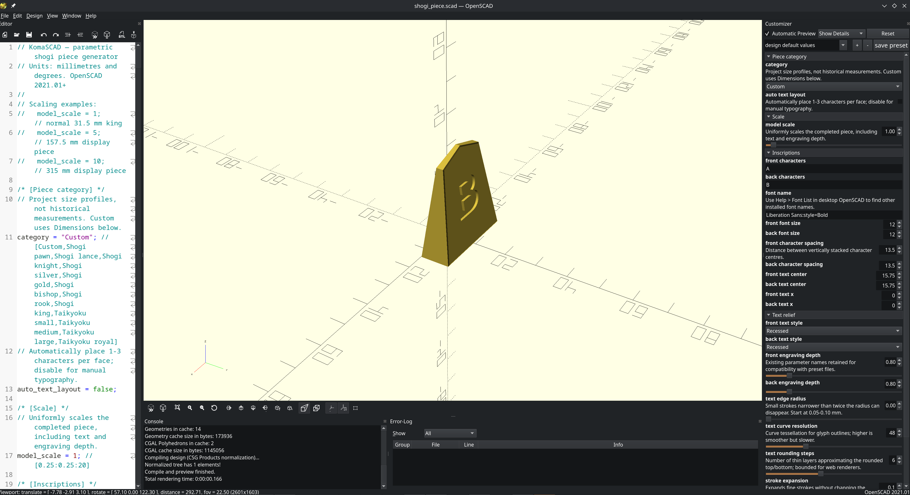

# KomaSCAD


KomaSCAD makes 3D-printable shogi pieces. You give it the characters, the size
and the font. It gives you a piece that you can print in one color or in
several colors.

It has three parts:

- `shogi_piece.scad`: the piece model, for OpenSCAD.
- `komascad.py`: a command-line tool that builds, checks and exports full sets.
- `move-editor.html`: a browser page that draws how a piece moves, for
  learner pieces.



## What you can make

- Full shogi and minishogi sets, with the correct number of each piece.
- Learner sets: each piece shows a diagram of how it moves.
- Your own pieces, for any shogi variant, in any font that has the characters.
- Multicolor 3MF files for Bambu Studio, OrcaSlicer, Elegoo Slicer and other
  slicers, and single-color STL files.

## Requirements

- [OpenSCAD 2021.01](https://openscad.org/downloads.html). The `openscad`
  command must be on your PATH.
- Python 3.8 or later. The tool uses only the standard library.
- The fonts in [fonts/](fonts/suggested_fonts.md). The bundled sets use Yuji
  Syuku and LXGW WenKai Mono. Install the fonts, then restart OpenSCAD.
- A filament 3D printer. For color, you need a printer that can change
  filament.

## Install

1. Download the repository (**Code → Download ZIP**), or clone it with Git.
2. Install the fonts from `fonts/`.
3. Restart OpenSCAD.

Keep `shogi_piece.scad`, `move_diagrams.scad` and `shogi_piece.json` in the
same folder. OpenSCAD reads the presets from the JSON file that has the same
name as the model.

## Print a set

Open a terminal in the repository folder. Then do these steps:

1. Show the games:

   ```bash
   python3 komascad.py list
   ```

2. Check the pieces on one page. Open the HTML file that the command shows.

   ```bash
   python3 komascad.py preview shogi
   ```

3. Export the full set as one color 3MF:

   ```bash
   python3 komascad.py export shogi --per-file all --orientation front-down
   ```

4. Open the 3MF from `exports/shogi/` in your slicer.
5. Load filament 1 = wood, 2 = black, 3 = red.
6. Print one piece first. Then print the set.

The [print guide](docs/printing/print-guide.md) gives the slicer settings that
we use. The [command reference](docs/cli.md) gives all export options.

## Design a piece

1. Open `shogi_piece.scad` in OpenSCAD.
2. If you cannot see the Customizer, clear **Window → Hide Customizer**.
3. Select a preset, for example **Shogi 01 - King (Osho)**.
4. Change the settings. The preview changes immediately.
5. Set **Output Mode** to **Inspect front**. Red text is outside the safe
   area: make it smaller or move it.
6. Set **Output Mode** to **Model** again.
7. Save your settings as a new preset (the **+** button).
8. For one color: press F6, then **File → Export → Export as STL**.
9. For several colors: export the preset with the tool:

   ```bash
   python3 komascad.py export shogi_piece.json "My piece"
   ```

The [design guide](docs/design-guide.md) tells you how to change the shape,
the text, the colors and the signature.

## Documentation

| Guide | Use it to |
| --- | --- |
| [User guide](docs/user-guide.md) | Change the bundled sets, and add pieces and games |
| [Design guide](docs/design-guide.md) | Design a piece in OpenSCAD |
| [Movement diagrams](docs/move-diagrams.md) | Draw the move diagrams of learner pieces |
| [Command reference](docs/cli.md) | Use every `komascad.py` command and option |
| [Parameter reference](docs/parameters.md) | Look up one OpenSCAD setting |
| [Print guide](docs/printing/print-guide.md) | Set up your slicer and print |
| [Print test page](docs/print-test-page.md) | Measure what your printer can make |
| [Contributing](CONTRIBUTING.md) | Report a problem, change the code, make a release |

## Repository contents

| Path | Contents |
| --- | --- |
| `shogi_piece.scad` | The piece model |
| `move_diagrams.scad` | The movement diagram solver, used by the model |
| `komascad.py` | The command-line tool |
| `move-editor.html` | The movement diagram editor |
| `presets/pieces/` | One file for each piece. Edit these. |
| `presets/games.json` | The pieces in each game. Edit this. |
| `presets/games/`, `shogi_piece.json`, `presets/print-test/` | Generated by `komascad.py build`. Do not edit. |
| `presets/misc/` | Hand-kept presets: chu shogi learner pieces and Taikyoku |
| `docs/` | The guides |
| `fonts/` | Open fonts and their licenses |
| `data/` | Taikyoku piece data (CC BY-SA 4.0) |
| `models/` | Print files that we release |
| `tests/` | Tests: `python3 -m unittest discover tests` |

## Contributors

[@imtrmu](https://github.com/imtrmu) proposed the parametric design. He also
tests the prints and finds what does and does not print well. KomaSCAD is much
better because of his work. See [CONTRIBUTORS.md](CONTRIBUTORS.md).

## License

The code, the documentation, the images and the shogi presets use the
[MIT License](LICENSE). The Taikyoku data and presets use
[CC BY-SA 4.0](LICENSES/CC-BY-SA-4.0.txt). The fonts use the SIL Open Font
License. Read [LICENSES.md](LICENSES.md) before you share a print file.
